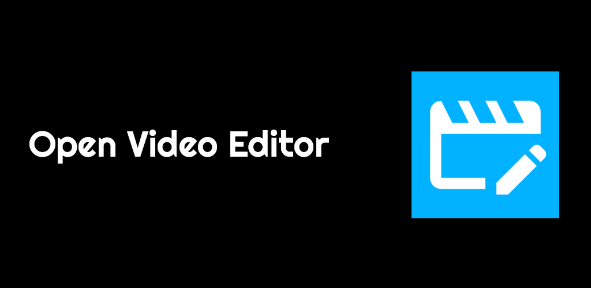
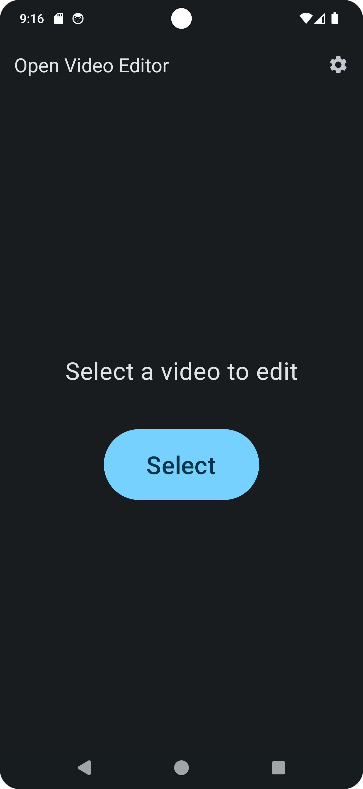
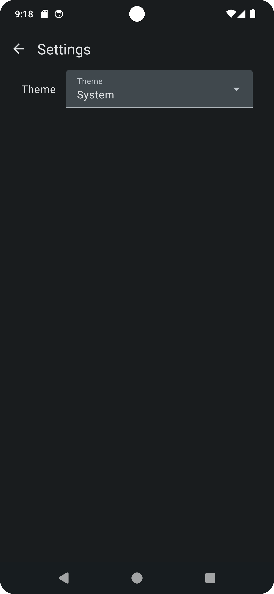
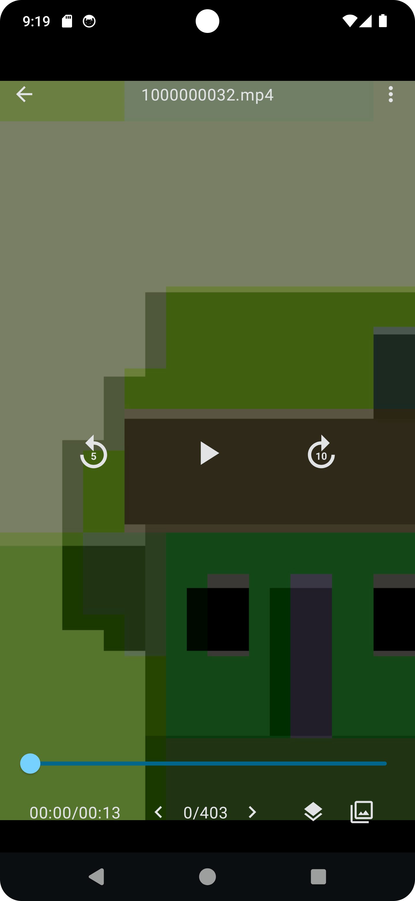
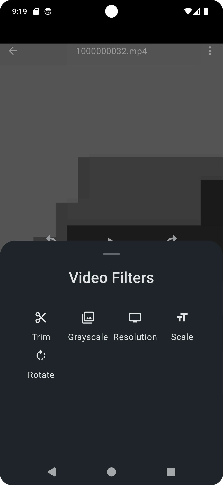
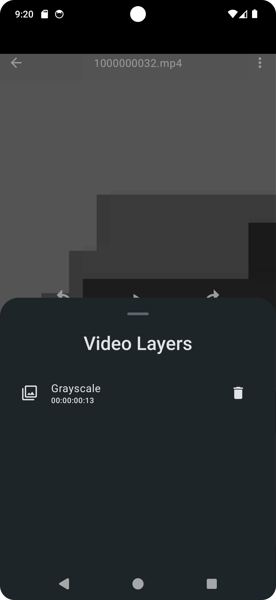
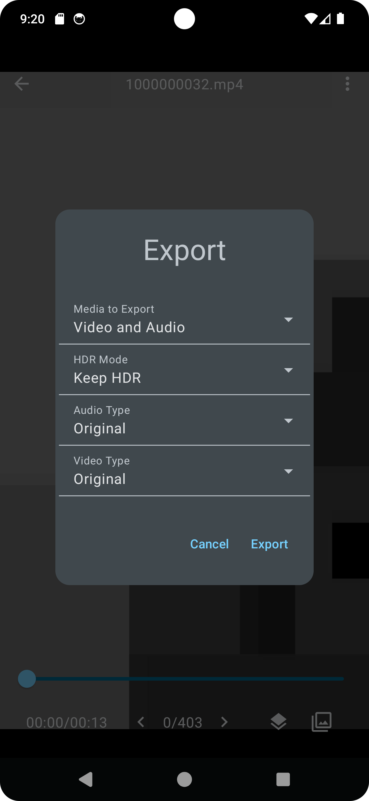
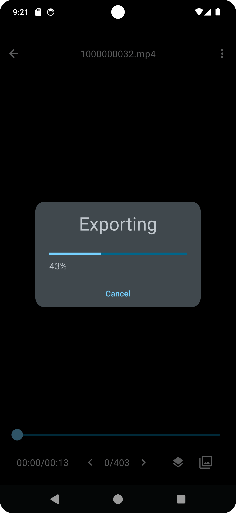

# Open Video Editor

## Install

## Features
- Trim
- Grayscale
- Resolution
- Scale
- Rotate

## Translations
https://hosted.weblate.org/engage/open-video-editor

## Roadmap
https://github.com/devhyper/open-video-editor/milestones

## Screenshots

    
    
    
    
    
    
    
    

